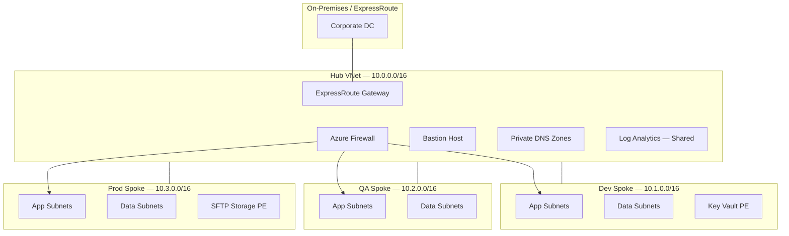

# Platform Architecture

## Document Control

| Field | Value |
|-------|-------|
| Version | 1.2 |
| Last Updated | 2026-06-01 |
| Owner | Platform Engineering |
| Review Cycle | Quarterly |

## Executive Summary

This document describes the Azure landing zone architecture implemented by the Platform Engineering team for enterprise workloads. The design follows Microsoft's Cloud Adoption Framework (CAF) hub-and-spoke model with identity-centric security, centralized egress, and environment-isolated spokes.

## Design Principles

1. **Single egress point** — All outbound internet traffic routes through Azure Firewall in the hub
2. **Private by default** — PaaS services use private endpoints; public access disabled where policy allows
3. **Identity over secrets** — User-assigned managed identities and Azure RBAC; no long-lived credentials in code
4. **Immutable infrastructure** — Changes via Terraform/OpenTofu pipelines, not portal drift
5. **Observable** — Diagnostic settings, Azure Monitor agents, and centralized Log Analytics

## High-Level Topology

See [diagrams/hub-spoke-topology.mmd](../diagrams/hub-spoke-topology.mmd) for the canonical diagram.



## Subscription & Management Group Layout

| Management Group | Subscription | Purpose |
|------------------|--------------|---------|
| `mg-connectivity` | `sub-connectivity` | Hub, DNS, firewall, Bastion, ExpressRoute |
| `mg-management` | `sub-management` | Log Analytics, automation, Terraform state |
| `mg-shared` | `sub-shared` | Shared Key Vault, compute gallery |
| `mg-nonprod` | `sub-workload-dev` | Development workloads |
| `mg-nonprod` | `sub-workload-qa` | QA / pre-production |
| `mg-prod` | `sub-workload-prod` | Production workloads |

See [Platform Governance](platform-governance.md) for subscription boundaries and RBAC model.

## Network Design

### Address Space Allocation

| VNet | CIDR | Region | Notes |
|------|------|--------|-------|
| `vnet-hub-eus2-001` | 10.0.0.0/16 | East US 2 | Shared services |
| `vnet-spoke-dev-eus2-001` | 10.1.0.0/16 | East US 2 | Dev workloads |
| `vnet-spoke-qa-eus2-001` | 10.2.0.0/16 | East US 2 | QA workloads |
| `vnet-spoke-prod-eus2-001` | 10.3.0.0/16 | East US 2 | Production |

### Subnet Conventions

Subnet naming: `snet-{purpose}-{env}-eus2-{seq}`

| Purpose | Typical Prefix | Example |
|---------|----------------|---------|
| Application | `/24` | `snet-app-dev-eus2-001` — 10.1.1.0/24 |
| Data / DB | `/24` | `snet-data-prod-eus2-001` — 10.3.2.0/24 |
| Private Endpoint | `/27` | `snet-pe-prod-eus2-001` — 10.3.240.0/27 |
| Management | `/27` | `snet-mgmt-hub-eus2-001` — 10.0.250.0/27 |

### Routing

Spoke subnets use UDR `udr-spoke-{env}-eus2-default` pointing `0.0.0.0/0` to Azure Firewall private IP (`10.0.1.4`). VNet peering is configured with `use_remote_gateways = true` on spokes and `allow_gateway_transit = true` on hub.

### Network Security Groups

NSGs follow a deny-by-default inbound posture from Internet. Intra-spoke traffic is controlled at NSG level; east-west between spokes is denied at firewall unless explicitly allowlisted via application rule collections.

## Identity & Access Management

### Managed Identities

| Identity | Scope | Roles |
|----------|-------|-------|
| `id-platform-tf-{env}` | Subscription | Custom `PlatformTerraformDeployer` |
| `id-app-{app}-{env}` | Resource Group | `Key Vault Secrets User` on app vault |
| `id-sftp-prod-001` | SFTP storage account | `Storage Blob Data Contributor` (scoped) |

### Key Vault RBAC Model

Key Vaults use `enable_rbac_authorization = true`. Access policies are not used.

| Role | Assignee | Scope |
|------|----------|-------|
| `Key Vault Administrator` | Platform SPN / break-glass group | Vault |
| `Key Vault Secrets Officer` | Pipeline identity | Vault |
| `Key Vault Secrets User` | Workload managed identity | Vault |
| `Key Vault Reader` | Security audit group | Vault |

Secrets naming: `{application}/{environment}/{secret-name}` — e.g., `platform-sftp/prod/sftp-admin-ssh-key`.

## Compute Standardization

Linux VMs deployed via the `linux-vm` module enforce:

- Trusted Launch (Secure Boot + vTPM) on Gen2 images
- Azure Monitor Agent + Dependency Agent extensions
- Entra ID SSH login extension (prod) or bastion-only access (nonprod)
- CIS-hardened cloud-init baseline from shared storage account
- Automatic patching via Azure Update Manager maintenance configuration

Image reference: `Canonical:0001-com-ubuntu-server-jammy:22_04-lts-gen2:latest` (override per workload via variable).

## SFTP Transfer Platform

Production file exchange uses Azure Storage Account with SFTP enabled:

- Hierarchical namespace (ADLS Gen2) required
- Public network access disabled; private endpoint in `snet-pe-prod-eus2-001`
- Local users mapped to container-level ACLs (no shared keys in production)
- Diagnostic logs to `law-platform-eus2-001`; alerts on failed auth > 5/min

See [examples/sftp-platform/](../examples/sftp-platform/) for module composition.

## State & Pipeline Architecture

```
┌─────────────┐     OIDC      ┌──────────────────┐
│ GitHub /    │──────────────▶│ Azure Entra ID   │
│ GitLab CI   │               │ Federated Cred   │
└──────┬──────┘               └────────┬─────────┘
       │                               │
       │ plan/apply                    │ assumes
       ▼                               ▼
┌─────────────┐               ┌──────────────────┐
│ OpenTofu    │──────────────▶│ Storage Account  │
│ Runner      │  state R/W    │ stplatformtf001  │
└─────────────┘               └──────────────────┘
```

State file keys: `{env}/{component}/terraform.tfstate`

## Disaster Recovery

| Component | RPO | RTO | Strategy |
|-----------|-----|-----|----------|
| Terraform state | 0 | 1 hr | GRS storage, versioning enabled |
| Key Vault | 0 | 4 hr | Soft delete + purge protection; secret backup to secondary vault |
| SFTP data | 15 min | 4 hr | RA-GRS storage, object replication to secondary region |
| Hub firewall | N/A | 2 hr | Infrastructure redeploy from IaC; rule collections in Git |

## Compliance & Policy

Azure Policy initiatives assigned at management group level:

- `Deny-Public-IP-On-VM` (prod MG)
- `Deploy-Diagnostics-LogAnalytics` (all)
- `Require-Tags-CostCenter-Owner` (all)
- `Audit-KeyVault-PurgeProtection` (prod)

## Related Documents

- [Security & Governance](security-governance.md)
- [Operational Runbook](runbook.md)
- [Platform Principles](platform-principles.md)
- [Project Roadmap](project-roadmap.md)
