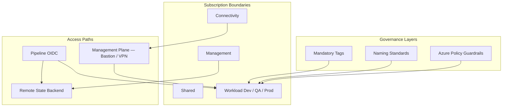
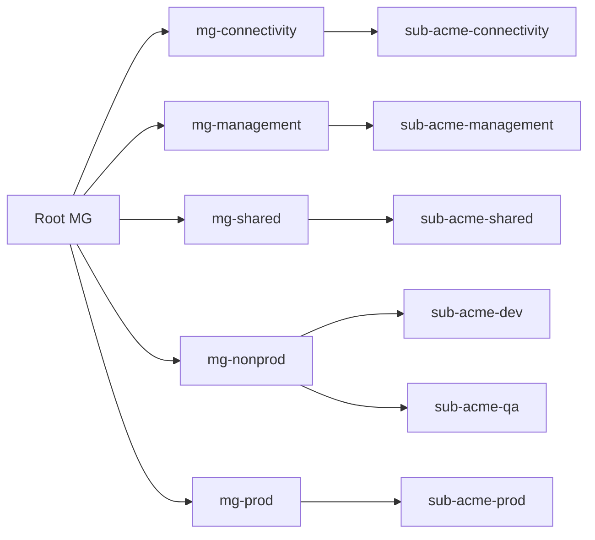

# Governance Model

How this platform is designed, secured, and operated. This document is the canonical reference for tags, naming, subscription layout, state management, management-plane access, and Azure Policy guardrails.

## Document Control

| Field | Value |
|-------|-------|
| Version | 1.0 |
| Owner | Platform Engineering |
| Audience | Platform engineers, security reviewers, hiring managers |
| Review Cycle | Quarterly |

---

## Overview



| Layer | Purpose |
|-------|---------|
| **Tags & naming** | Cost allocation, ownership, automation, policy targeting |
| **Subscriptions** | Blast-radius isolation between connectivity, management, and workloads |
| **State backend** | Durable, locked-down Terraform/OpenTofu state with pipeline-only write |
| **Management plane** | Human and break-glass access without workload public IPs |
| **Guardrails** | Azure Policy denies non-compliant resources before they reach production |

---

## 1. Mandatory Tags

Every resource deployed through platform modules must carry seven tags. Azure Policy initiative `platform-mandatory-tags` **denies** create and update when any tag is missing on production management groups.

| Tag Key | Description | Allowed Values / Format | Example |
|---------|-------------|-------------------------|---------|
| `environment` | Lifecycle stage | `dev`, `qa`, `prod`, `hub`, `shared` | `prod` |
| `application` | Workload or service code | Lowercase identifier matching naming workload segment | `platform-sftp` |
| `owner` | Operational contact | Valid email | `platform-team@acmecorp.com` |
| `cost-center` | Financial chargeback | `CC-####` | `CC-1042` |
| `data-classification` | Data sensitivity | `public`, `internal`, `confidential`, `restricted` | `confidential` |
| `managed-by` | Provisioning system | `terraform` or `pipeline` | `terraform` |
| `business-unit` | Division or business unit | Non-empty string | `engineering` |

### Enforcement

Tags are built in the [resource-group](../terraform/modules/resource-group/) module and propagated to all child resources via `module.resource_group.tags`:

```hcl
module "resource_group" {
  source = "../../modules/resource-group"

  name                = "rg-platform-app-prod-eus2-001"
  environment         = "prod"
  application_name    = "platform-app"
  owner_email         = "platform-team@acmecorp.com"
  cost_center         = "CC-1042"
  business_unit       = "engineering"
  data_classification = "confidential"
}

module "storage_account" {
  source = "../../modules/storage-account"
  tags   = module.resource_group.tags
  # ...
}
```

**Optional tags** (recommended, not policy-required): `patch-group`, `backup-tier`, `expiration-date` (non-prod decommission tracking).

Policy definition: [security/policy-examples/required-tags.md](../security/policy-examples/required-tags.md)

---

## 2. Naming Conventions

Resources follow a predictable pattern so engineers, pipelines, and policy engines can identify ownership and environment without opening the portal.

### Standard Pattern

```
{resource-type}-{workload}-{environment}-{region}-{instance}
```

| Segment | Description | Example |
|---------|-------------|---------|
| resource-type | Approved abbreviation | `rg`, `vnet`, `kv`, `vm` |
| workload | Short application code — matches `application` tag | `platform`, `sftp` |
| environment | Lifecycle stage | `dev`, `qa`, `prod` |
| region | Location code | `eus2`, `wus2` |
| instance | Three-digit sequence within scope | `001` |

**Storage accounts** omit hyphens (Azure global uniqueness constraint):

```
{st}{workload}{environment}{instance}  →  stplatformprod001
```

### Approved Abbreviations

| Resource | Prefix | Example |
|----------|--------|---------|
| Resource group | `rg` | `rg-platform-app-prod-eus2-001` |
| Virtual network | `vnet` | `vnet-spoke-prod-eus2-001` |
| Subnet | `snet` | `snet-app-prod-eus2-001` |
| NSG | `nsg` | `nsg-app-prod-eus2-001` |
| Route table | `udr` | `udr-spoke-prod-eus2-default` |
| Key Vault | `kv` | `kv-platform-prod-eus2-001` (≤24 chars) |
| Storage account | `st` | `stplatformprod001` |
| Linux VM | `vm` | `vm-app-prod-eus2-001` |
| Managed identity | `id` | `id-platform-app-prod-001` |
| Private endpoint | `pe` | `pe-kv-platform-prod-eus2-001` |
| Log Analytics | `law` | `law-platform-prod-eus2-001` |
| Azure Firewall | `afw` | `afw-hub-eus2-001` |
| Bastion | `bas` | `bas-hub-eus2-001` |

### Rules

- No ad-hoc names (`test-vm`, `rg-temp`, `kv123`) in non-experimental scopes
- `environment` must appear in every workload resource name
- Workload segment must match the `application` tag value
- Deleted production names are not reused without a change ticket

Full reference: [platform-principles.md](platform-principles.md#2-naming-conventions)

---

## 3. Multi-Subscription Design

Workloads are isolated across subscriptions under management groups. The management and connectivity planes are separated from application deployments.

### Subscription Map

| Management Group | Subscription | Purpose |
|------------------|--------------|---------|
| `mg-connectivity` | `sub-acme-connectivity` | Hub VNet, Azure Firewall, ExpressRoute, Bastion, private DNS |
| `mg-management` | `sub-acme-management` | Log Analytics, automation accounts, **Terraform state storage** |
| `mg-shared` | `sub-acme-shared` | Shared Key Vault (platform secrets), compute gallery, patch assets |
| `mg-nonprod` | `sub-acme-dev` | Development workloads |
| `mg-nonprod` | `sub-acme-qa` | QA / pre-production |
| `mg-prod` | `sub-acme-prod` | Production workloads |



### Design Principles

| Principle | Implementation |
|-----------|----------------|
| Blast-radius isolation | Compromise in dev cannot reach prod subscription RBAC |
| Management vs workload | Platform services (state, logging) live outside workload subscriptions |
| Pipeline scoping | Separate pipeline identity per environment subscription |
| Central logging | Diagnostic settings ship to `law-platform-eus2-001` in management or connectivity sub |
| Key Vault strategy | Platform secrets in `sub-acme-shared`; per-workload vaults in workload subs for app secrets |
| No standing Owner | Owner role blocked; Reader for operators; custom deploy roles for pipelines |

Subscription and RBAC definitions: [security/access-management/users-groups.yml](../security/access-management/users-groups.yml)

Architecture detail: [architecture.md](architecture.md)

---

## 4. Remote State & Backend Access

Terraform/OpenTofu state is stored in Azure Storage — never locally and never in Git.

### State Storage Configuration

| Setting | Value |
|---------|-------|
| Storage account | `stplatformtf001` |
| Resource group | `rg-platform-tfstate-eus2-001` |
| Subscription | `sub-acme-management` |
| Container | `tfstate` (private access) |
| Replication | GRS with blob versioning |
| Public network access | **Disabled** |
| Shared key access | Disabled after pipeline RBAC is configured |
| Private endpoint | Preferred on hub management subnet |

### State Key Layout

```
tfstate/
├── dev/platform/terraform.tfstate
├── qa/platform/terraform.tfstate
├── prod/platform/terraform.tfstate
└── bootstrap/state-backend/terraform.tfstate
```

### Backend Configuration

Environments use OIDC — no storage account keys in CI secrets:

```hcl
terraform {
  backend "azurerm" {
    resource_group_name  = "rg-platform-tfstate-eus2-001"
    storage_account_name = "stplatformtf001"
    container_name       = "tfstate"
    key                  = "prod/platform/terraform.tfstate"
    use_oidc             = true
  }
}
```

Bootstrap stack: [terraform/bootstrap/state-backend/](../terraform/bootstrap/state-backend/)

### State Access Matrix

| Principal | Role | Scope | Use |
|-----------|------|-------|-----|
| `id-platform-tf-dev` | Storage Blob Data Contributor | `dev/` state prefix | Dev pipeline read/write |
| `id-platform-tf-qa` | Storage Blob Data Contributor | `qa/` state prefix | QA pipeline read/write |
| `id-platform-tf-prod` | Storage Blob Data Contributor | `prod/` state prefix | Prod pipeline read/write |
| Platform engineers | Storage Blob Data Reader | Container (non-prod only) | Local plan debugging |
| Break-glass (PIM) | Storage Blob Data Owner | Container | Emergency recovery only |

**Normal deployments never use break-glass.** Pipeline managed identity with federated OIDC credentials is the only approved write path.

Detailed procedures: [backend-state-governance.md](backend-state-governance.md)

---

## 5. Management-Plane Access

Human operators and emergency responders reach workloads through the **management plane** — not through public IPs on application resources.

### Approved Access Paths

| Method | Location | Use Case |
|--------|----------|----------|
| **Azure Bastion** | Hub (`sub-acme-connectivity`) | Interactive SSH/RDP to private VMs |
| **VPN / ExpressRoute** | Hub | Corporate network extension into Azure |
| **Private jump host** | Hub management subnet | Automation, file transfer, restricted tooling |
| **Entra ID SSH** | Workload VM | Keyless SSH where policy permits (prod optional) |

Workload VMs **do not receive public IP addresses**. The [linux-vm](../terraform/modules/linux-vm/) module has no public IP resource or variable.

### Management vs Data Plane

| Plane | Who | How | Examples |
|-------|-----|-----|----------|
| **Deployment** | Pipeline MI / SP | OIDC + custom RBAC | `tofu apply`, access-sync |
| **Operations** | Platform engineers | Bastion, VPN, runbooks | SSH via Bastion, log queries |
| **Break-glass** | PIM-eligible admins | Time-bound elevated role | State recovery, incident response |

Break-glass access:

- Activated through PIM with maximum 4-hour window
- Requires incident or change ticket before activation
- Post-incident review within 24 hours
- Documented in [runbook.md](runbook.md) and [backend-state-governance.md](backend-state-governance.md)

### Network Controls Supporting Management Access

- Hub-and-spoke topology with centralized firewall egress
- NSG default deny inbound from Internet on workload subnets
- Optional NSG rule allowing SSH **only** from Bastion subnet prefix
- Private DNS zones in hub for Private Link name resolution

Example: [examples/secure-platform-baseline/](../examples/secure-platform-baseline/)

---

## 6. Platform Guardrails

Azure Policy initiatives enforce compliance at management group scope. Non-compliant resources are denied in production; non-prod may audit first, then deny.

### Guardrail Summary

| Guardrail | Policy Effect | Scope | Module / Doc Alignment |
|-----------|---------------|-------|------------------------|
| **Deny public IPs** | Deny | Workload MG | [linux-vm](../terraform/modules/linux-vm/), [deny-public-ip.md](../security/policy-examples/deny-public-ip.md) |
| **Require mandatory tags** | Deny | All | [resource-group](../terraform/modules/resource-group/), [required-tags.md](../security/policy-examples/required-tags.md) |
| **Allowed regions only** | Deny | All | `eastus2`, `wus2` — [allowed-regions.md](../security/policy-examples/allowed-regions.md) |
| **Require diagnostic settings** | DeployIfNotExists / Audit | All | KV, storage, VM modules — [require-diagnostics.md](../security/policy-examples/require-diagnostics.md) |
| **Require private endpoints** | Audit → Deny | Prod MG | [private-endpoint](../terraform/modules/private-endpoint/), [require-private-endpoint.md](../security/policy-examples/require-private-endpoint.md) |
| **Block manual prod changes** | Process + drift detection | Prod | Pipeline-only apply; portal drift corrected on next run |

### Identity Guardrails

| Rule | Enforcement |
|------|-------------|
| No Owner / Contributor on pipelines | [role-assignment](../terraform/modules/role-assignment/) module validation + access catalog |
| Custom RBAC for deployment SPs | [security/custom-rbac/](../security/custom-rbac/) |
| Groups and users in Git | [users-groups.yml](../security/access-management/users-groups.yml) + [access-sync.yml](../.github/workflows/access-sync.yml) |
| Managed identities for workloads | [managed-identity](../terraform/modules/managed-identity/) module |
| Secrets in Key Vault only | RBAC-enabled vaults; no secrets in Git |

### Operational Guardrails

| Rule | Implementation |
|------|----------------|
| PR-required changes | All infrastructure changes via pull request |
| CI validation before merge | [validation.yml](../.github/workflows/validation.yml) — fmt, validate, lint, Checkov |
| Environment promotion | dev (auto) → qa (1 approval) → prod (2 approvals + change ticket) |
| Runbooks for production services | [runbook.md](runbook.md) |

Policy index: [security/policy-examples/README.md](../security/policy-examples/README.md)

---

## Related Documents

| Document | Focus |
|----------|-------|
| [architecture.md](architecture.md) | Hub-spoke topology, network design |
| [security-governance.md](security-governance.md) | Security controls, image lifecycle |
| [backend-state-governance.md](backend-state-governance.md) | State lock, break-glass procedures |
| [platform-principles.md](platform-principles.md) | Engineering standards, CI/CD |
| [runbook.md](runbook.md) | Incident response and operations |
| [secure-platform-baseline](../examples/secure-platform-baseline/) | End-to-end module composition example |

---

## Revision History

| Date | Author | Change |
|------|--------|--------|
| 2026-06-01 | Platform Engineering | Initial governance model |
