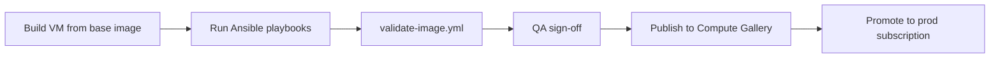

# Security & Governance

Platform security standards for Azure infrastructure, access management, and Linux image lifecycle.

> **Full governance framework:** [Governance Model](governance-model.md) — mandatory tags, naming, multi-subscription layout, state backend, guardrails, network, identity, and operations.

## Document Control

| Field | Value |
|-------|-------|
| Version | 1.0 |
| Owner | Platform Engineering / Security |
| Review Cycle | Quarterly |

## Core Principles

| Principle | Requirement |
|-----------|-------------|
| **Private by default** | PaaS via private endpoints; no public network access on production data planes |
| **No public IPs on workloads** | Workload VMs do not receive public IP addresses |
| **Least privilege by default** | Scoped custom RBAC for automation; no Owner/Contributor on deployment principals |
| **Pipeline-only changes** | Production infrastructure changes via approved CI/CD pipelines only |
| **Source-controlled access** | Users, groups, and assignments defined in Git and enforced by pipeline |
| **Secrets in Key Vault** | No credentials, keys, or connection strings in source control |
| **No manual production changes** | Portal changes corrected by next pipeline run or treated as incidents |
| **Hardened image lifecycle** | Images built, validated, and promoted through repeatable automation |

## 1. No Public IP Standard

Workload virtual machines must not be assigned public IP addresses. Remote administration uses approved private paths:

- Azure Bastion (hub-hosted)
- VPN / ExpressRoute into hub network
- Private jump hosts on management subnets
- Entra ID–based SSH where policy allows

The `linux-vm` Terraform module creates NICs with private allocation only and does not expose a `public_ip` variable. Public IP attachment requires a documented security exception approved by the Cloud Architect with an expiration date.

See:
- [security/policy-examples/deny-public-ip.md](../security/policy-examples/deny-public-ip.md)
- [examples/no-public-ip/](../examples/no-public-ip/)

## 2. Least-Privilege Access

Built-in roles such as **Owner** and **Contributor** grant far more permissions than deployment pipelines require. Platform automation uses **custom RBAC roles** scoped to resource groups or subscriptions.

| Role Category | Custom Role | Typical Assignee |
|---------------|-------------|------------------|
| Network | `PlatformDeploy-Network` | Pipeline SPN / MI |
| Compute | `PlatformDeploy-Compute` | Pipeline SPN / MI |
| Key Vault | `PlatformDeploy-KeyVault` | Pipeline SPN / MI |
| Storage | `PlatformDeploy-Storage` | Pipeline SPN / MI |
| Monitoring | `PlatformDeploy-Monitoring` | Pipeline SPN / MI |

Role definitions: [security/custom-rbac/](../security/custom-rbac/)

### Why Not Contributor?

| Contributor Capability | Needed for Deploy? | Risk if Compromised |
|------------------------|-------------------|---------------------|
| Create/delete any resource type | Partial — only declared modules | Lateral movement, data exfiltration |
| Modify NSGs and routes | Yes — network module | Network bypass |
| Assign RBAC roles | Sometimes — prefer separate UAA scope | Privilege escalation |
| Read all secrets via data plane | No — use scoped Key Vault roles | Credential theft |

Custom roles grant **Actions** required for Terraform apply and omit destructive or unrelated permissions.

## 3. Custom RBAC for Service Principals

Deployment service principals (or pipeline managed identities) receive:

1. Custom deploy roles at subscription or resource-group scope
2. `User Access Administrator` **only** when the pipeline must create role assignments — prefer pre-provisioned assignments where possible
3. Separate principals per environment (`dev`, `qa`, `prod`)

Deploy custom roles via pipeline or bootstrap Terraform:

```bash
az role definition create --role-definition security/custom-rbac/deployment-sp-compute-role.json
az role assignment create \
  --assignee "$PIPELINE_OBJECT_ID" \
  --role "PlatformDeploy-Compute" \
  --scope "/subscriptions/$SUBSCRIPTION_ID/resourceGroups/rg-platform-shared-prod-eus2-001"
```

## 4. Pipeline-Managed Users and Groups

Entra ID groups, membership, and Azure RBAC assignments are defined in [security/access-management/users-groups.yml](../security/access-management/users-groups.yml).

### Desired-State Model

```
Git (users-groups.yml) → Pipeline validate/diff → Azure Entra / RBAC apply → Audit log
```

- **Source of truth:** Git repository on `main`
- **Manual portal changes:** Detected on next pipeline run and reverted or flagged
- **Drift handling:** Pipeline opens alert / fails until Git is updated or drift is approved via change ticket

Workflow: [.github/workflows/access-sync.yml](../.github/workflows/access-sync.yml)

## 5. Ansible Hardening & Image Lifecycle

Linux images are hardened using Ansible playbooks under [ansible/](../ansible/) before capture as Azure Compute Gallery images or deployment via cloud-init.

### Build → Test → Promote



| Stage | Playbooks | Gate |
|-------|-----------|------|
| Baseline | `baseline-hardening.yml`, `ssh-hardening.yml` | CIS-aligned checks |
| Audit | `audit-logging.yml` | rsyslog/auditd forwarding verified |
| Validation | `validate-image.yml` | All assertions pass; no open ports except 22 from bastion SG |

Documentation: [ansible/README.md](../ansible/README.md)

## 6. Secrets Management

- Application and pipeline secrets stored in Azure Key Vault with RBAC
- Key Vault references in Terraform use managed identity — never embed secret values
- `.tfvars` files containing secrets are gitignored; use `terraform.tfvars.example` only

## 7. Production Change Control

| Change Type | Allowed Path |
|-------------|--------------|
| Infrastructure | Merge to `main` → pipeline apply with approvals |
| RBAC / group membership | PR to `users-groups.yml` → access-sync pipeline |
| Security exception (e.g. public IP) | Architecture review + time-bound policy exemption |
| Break-glass | Incident ticket + revert within 24 hours via IaC |

## 8. Azure Policy

Policy initiative examples document enforceable controls:

- [deny-public-ip.md](../security/policy-examples/deny-public-ip.md)
- [required-tags.md](../security/policy-examples/required-tags.md)

## Related Documents

- [Platform Principles](platform-principles.md)
- [Architecture](architecture.md)
- [Operational Runbook](runbook.md)
