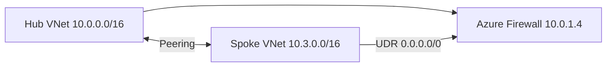

# Hub-and-Spoke Networking Example

Reference composition using dedicated network modules with centralized egress via Azure Firewall.

## Architecture



## Usage

```hcl
module "resource_group" {
  source = "../../terraform/modules/resource-group"
  # ...
}

module "virtual_network" {
  source = "../../terraform/modules/virtual-network"

  name                = "vnet-spoke-prod-eus2-001"
  resource_group_name = module.resource_group.name
  location            = module.resource_group.location
  environment         = "prod"
  address_space       = ["10.3.0.0/16"]

  peer_to_hub = {
    hub_vnet_id             = var.hub_vnet_id
    hub_resource_group_name = "rg-hub-network-eus2-001"
    hub_vnet_name           = "vnet-hub-eus2-001"
  }

  tags = local.platform_tags
}

module "subnet_app" {
  source = "../../terraform/modules/subnet"

  name                 = "snet-app-prod-eus2-001"
  resource_group_name  = module.resource_group.name
  virtual_network_name = module.virtual_network.name
  address_prefixes     = ["10.3.1.0/24"]
  environment          = "prod"
  service_endpoints    = ["Microsoft.KeyVault"]
  tags                 = local.platform_tags
}

module "network_security_group_app" {
  source = "../../terraform/modules/network-security-group"

  name                = "nsg-app-prod-eus2-001"
  resource_group_name = module.resource_group.name
  location            = module.resource_group.location
  environment         = "prod"
  subnet_ids          = [module.subnet_app.id]
  tags                = local.platform_tags
}

module "route_table_spoke" {
  source = "../../terraform/modules/route-table"

  name                = "udr-spoke-prod-eus2-default"
  resource_group_name = module.resource_group.name
  location            = module.resource_group.location
  environment         = "prod"
  subnet_ids          = [module.subnet_app.id]

  routes = [{
    name                   = "default-via-firewall"
    address_prefix         = "0.0.0.0/0"
    next_hop_type          = "VirtualAppliance"
    next_hop_in_ip_address = "10.0.1.4"
  }]

  tags = local.platform_tags
}
```

## Related

- [Architecture](../../docs/architecture.md#network-design)
- [Modules README](../../terraform/modules/README.md)
