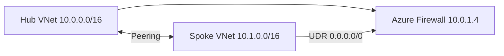

# Hub-and-Spoke Networking Example

Reference composition for deploying a spoke VNet peered to an existing hub with centralized egress via Azure Firewall.

## Architecture



## Prerequisites

- Hub VNet already deployed (`vnet-hub-eus2-001`)
- Azure Firewall private IP documented in hub outputs
- Pipeline identity with `Network Contributor` on spoke RG and peering permissions on hub RG

## Usage

```hcl
module "rg_network" {
  source = "../../terraform/modules/resource-group"

  name             = "rg-platform-app-prod-eus2-001"
  environment      = "prod"
  cost_center      = "CC-1042"
  owner_email      = "platform-team@example.com"
  application_name = "platform-app"
}

module "spoke_network" {
  source = "../../terraform/modules/virtual-network"

  name                = "vnet-spoke-prod-eus2-001"
  resource_group_name = module.rg_network.name
  location            = module.rg_network.location
  address_space       = ["10.3.0.0/16"]

  hub_firewall_private_ip = "10.0.1.4"
  dns_servers             = ["10.0.2.4"]

  peer_to_hub = {
    hub_vnet_id             = var.hub_vnet_id
    hub_resource_group_name = "rg-hub-network-eus2-001"
    hub_vnet_name           = "vnet-hub-eus2-001"
  }

  subnets = {
    snet-app-prod-eus2-001 = {
      address_prefixes  = ["10.3.1.0/24"]
      service_endpoints = ["Microsoft.KeyVault"]
    }
    snet-data-prod-eus2-001 = {
      address_prefixes = ["10.3.2.0/24"]
    }
    snet-pe-prod-eus2-001 = {
      address_prefixes = ["10.3.240.0/27"]
    }
  }

  tags = module.rg_network.tags
}
```

## Operational Notes

- Spoke-to-spoke traffic is denied at firewall unless application rules exist
- Gateway transit enabled on hub peering for ExpressRoute path
- Validate peering status after apply: `az network vnet peering list`

## Related

- [Architecture](../../docs/architecture.md#network-design)
- [Runbook — Firewall](../../docs/runbook.md#3-runbook-hub-firewall-unavailable)
