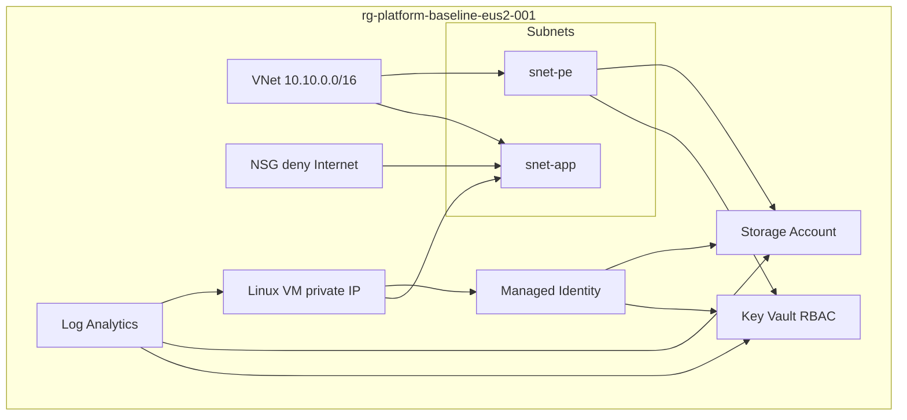

# Secure Platform Baseline

End-to-end example wiring platform modules into a single secure spoke stack suitable for portfolio review.

## What This Demonstrates

| Capability | Module |
|------------|--------|
| Tagged resource group | `resource-group` |
| Central logging | `log-analytics-workspace` |
| Spoke network | `virtual-network` |
| Segmented subnets | `subnet` |
| Deny-by-default NSG | `network-security-group` |
| Private storage | `storage-account` + `private-endpoint` |
| RBAC Key Vault | `key-vault` + `private-endpoint` |
| Workload identity | `managed-identity` |
| Least-privilege RBAC | `role-assignment` |
| Private Linux VM | `linux-vm` (no public IP) |

## Architecture



## Prerequisites

- OpenTofu >= 1.6 or Terraform >= 1.5
- Azure subscription and `Contributor`-equivalent **custom** deploy roles for the pipeline principal
- SSH public key via `TF_VAR_ssh_public_key`

## Deploy

```bash
cd examples/secure-platform-baseline
cp terraform.tfvars.example terraform.tfvars
# Edit tenant_id and pipeline_object_id

export TF_VAR_ssh_public_key="$(cat ~/.ssh/id_ed25519.pub)"

tofu init
tofu plan
tofu apply
```

## Security Notes

- No `azurerm_public_ip` resources anywhere in this stack
- Storage and Key Vault use private endpoints on a dedicated subnet
- Role assignments use data-plane roles — not Contributor
- Deploy via pipeline in production; local apply is for development only

## Related

- [Module index](../../terraform/modules/README.md)
- [Security governance](../../docs/security-governance.md)
