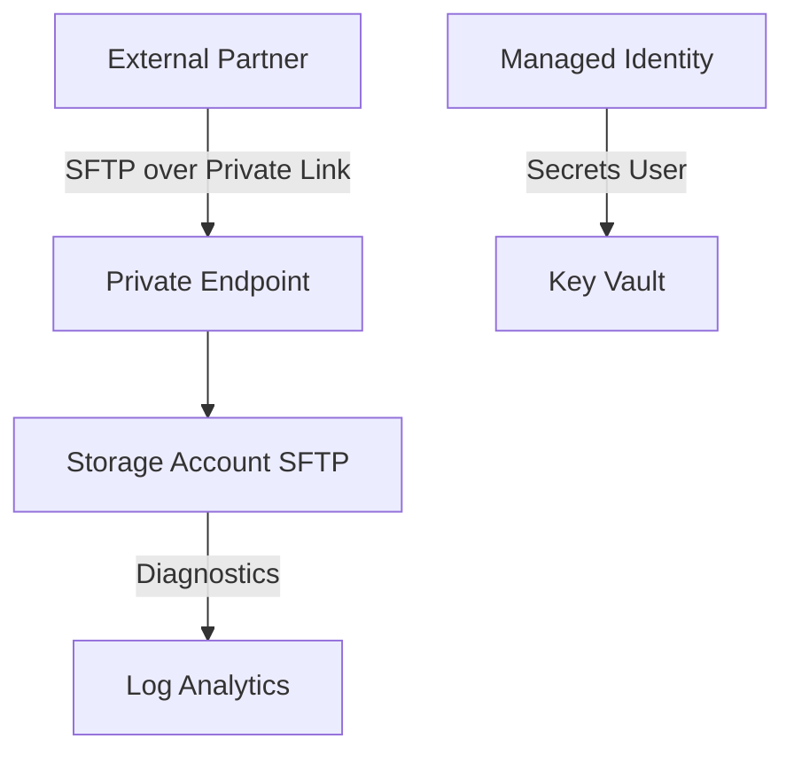

# SFTP Transfer Platform Example

Azure Storage SFTP platform for B2B file exchange with private endpoints, local users, and audit logging.

## Architecture



## Design Requirements

- Hierarchical namespace (ADLS Gen2) enabled
- SFTP enabled; shared key access disabled in production
- Public network access disabled
- Local users with container-scoped RBAC (not subscription-wide)
- Diagnostic logs shipped to central Log Analytics
- Customer-managed keys optional for `confidential` classification

## Terraform Composition

```hcl
module "rg_sftp" {
  source = "../../terraform/modules/resource-group"

  name                = "rg-platform-sftp-prod-eus2-001"
  environment         = "prod"
  cost_center         = "CC-1042"
  owner_email         = "platform-team@acmecorp.com"
  application_name    = "platform-sftp"
  data_classification = "confidential"

  enable_management_lock = true
}

resource "azurerm_user_assigned_identity" "sftp" {
  name                = "id-platform-sftp-prod-001"
  resource_group_name = module.rg_sftp.name
  location            = module.rg_sftp.location
  tags                = module.rg_sftp.tags
}

resource "azurerm_storage_account" "sftp" {
  name                     = "stplatformsftpprod001"
  resource_group_name      = module.rg_sftp.name
  location                 = module.rg_sftp.location
  account_tier             = "Standard"
  account_replication_type = "GRS"
  account_kind             = "StorageV2"
  is_hns_enabled           = true

  sftp_enabled                  = true
  public_network_access_enabled = false
  shared_access_key_enabled     = false
  min_tls_version               = "TLS1_2"

  tags = module.rg_sftp.tags
}

resource "azurerm_private_endpoint" "sftp" {
  name                = "pe-stplatformsftpprod001"
  resource_group_name = module.rg_sftp.name
  location            = module.rg_sftp.location
  subnet_id           = var.private_endpoint_subnet_id

  private_service_connection {
    name                           = "psc-sftp-blob"
    private_connection_resource_id = azurerm_storage_account.sftp.id
    subresource_names              = ["blob"]
    is_manual_connection           = false
  }

  private_dns_zone_group {
    name                 = "default"
    private_dns_zone_ids = [var.private_dns_zone_blob_id]
  }
}

resource "azurerm_role_assignment" "sftp_blob" {
  scope                = azurerm_storage_account.sftp.id
  role_definition_name = "Storage Blob Data Contributor"
  principal_id         = azurerm_user_assigned_identity.sftp.principal_id
}

resource "azurerm_monitor_diagnostic_setting" "sftp" {
  name                       = "diag-sftp"
  target_resource_id         = azurerm_storage_account.sftp.id
  log_analytics_workspace_id = var.log_analytics_workspace_id

  enabled_log {
    category = "StorageRead"
  }
  enabled_log {
    category = "StorageWrite"
  }
}
```

## Partner Onboarding Checklist

1. Create dedicated container: `partner-{name}-inbound`
2. Create local user with SSH key — store private key reference in Key Vault
3. Assign container ACL: read/write scoped to partner container only
4. Provide connection details: `sftp.internal.acmecorp.com` (private DNS CNAME)
5. Open change ticket and update CMDB

## Monitoring Queries

Failed authentication (KQL):

```kusto
StorageBlobLogs
| where TimeGenerated > ago(24h)
| where OperationName contains "Sftp"
| where StatusText != "Success"
| summarize FailedAttempts = count() by CallerIpAddress, UserPrincipalName
| where FailedAttempts > 5
```

## Related

- [Runbook — SFTP Incident](../../docs/runbook.md#6-runbook-sftp-platform-incident)
- [Architecture — SFTP Platform](../../docs/architecture.md#sftp-transfer-platform)
