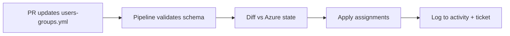

# Pipeline-Managed Access

Users, groups, and RBAC assignments are defined in [users-groups.yml](users-groups.yml) and enforced by [.github/workflows/access-sync.yml](../../.github/workflows/access-sync.yml).

## Subscription Boundaries

Pipeline principals are scoped per workload subscription; state access is limited to `sub-management`. See the `subscriptions:` and `service_principals:` blocks in [users-groups.yml](users-groups.yml) and [Platform Governance](../../docs/platform-governance.md#3-multi-subscription-governance).

## Principles

1. **Git is the source of truth** — not the Azure portal or Entra admin center
2. **Manual click-ops drift is corrected** on the next pipeline run
3. **Broad roles are blocked** — `Owner`, `Contributor`, and `User Access Administrator` are listed in `denied_roles`
4. **Changes require PR review** — same approval path as infrastructure

## Workflow



### Validate Stage

- YAML schema validation (required fields, UUID format)
- Denied role check on all assignments
- No duplicate principal+scope+role tuples

### Diff Stage

Compare desired state from Git against live Azure:

```bash
# Example diff concept — production pipeline uses az rest / Graph API
az role assignment list --scope "$SCOPE" -o json | jq '.[] | {principalId, roleDefinitionName}'
```

### Apply Stage

- Create missing role assignments
- Remove assignments present in Azure but absent from Git (with prod approval gate)
- Group membership sync via Microsoft Graph API (requires `Group.ReadWrite.All` on pipeline SP — scoped to defined groups only)

## Making Changes

1. Edit `users-groups.yml`
2. Open PR with change ticket reference
3. Pipeline posts diff comment on PR
4. Merge after approval → scheduled sync applies within 15 minutes

## Drift Detection

If an operator assigns **Contributor** manually in the portal:

1. Nightly drift job detects assignment not in Git
2. Alert sent to `#platform-ops`
3. Auto-remediation removes assignment **or** pipeline fails until Git is updated (configurable per environment)

Prod default: **fail and alert** — requires explicit PR to add assignment to source file.

## Required Pipeline Permissions

| Permission | Purpose | Scope |
|------------|---------|-------|
| `Microsoft.Authorization/roleAssignments/write` | Sync RBAC | Defined scopes only |
| Microsoft Graph `GroupMember.ReadWrite.All` | Sync group membership | Groups listed in YAML only |
| Key Vault Secrets User | Read Graph/client secrets | Pipeline vault |

Prefer **managed identity** with custom role `PlatformDeploy-AccessSync` (define separately) over Owner on subscription.

## Related

- [Security & Governance](../../docs/security-governance.md)
- [Custom RBAC Roles](../custom-rbac/README.md)
